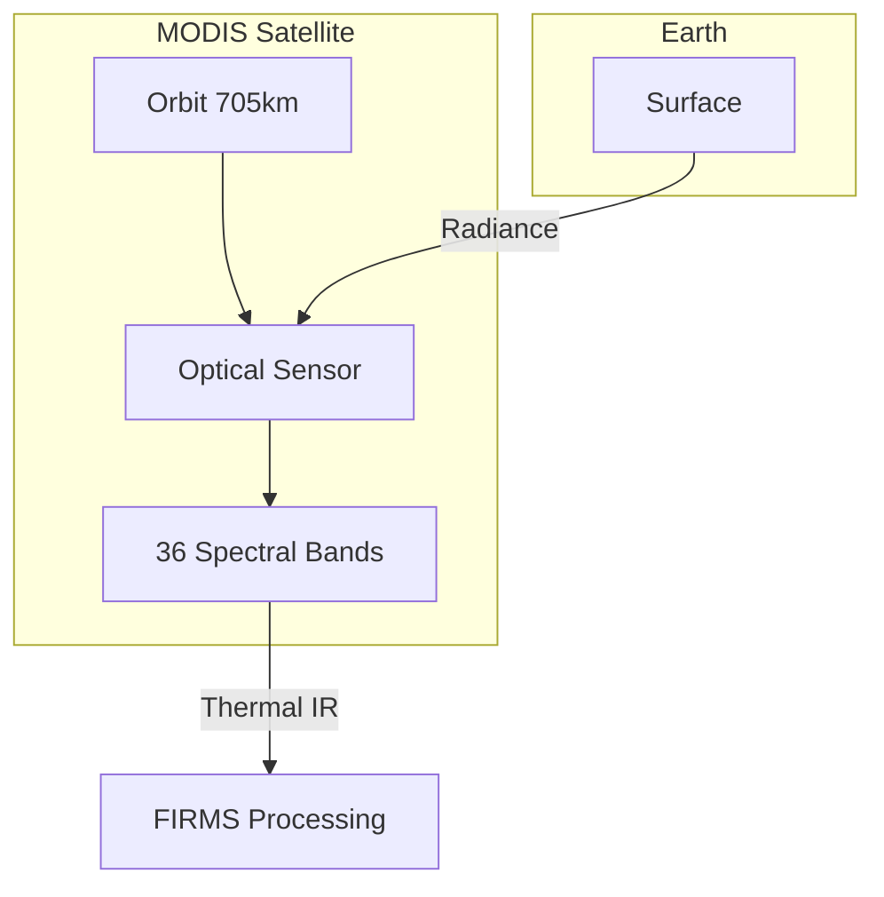
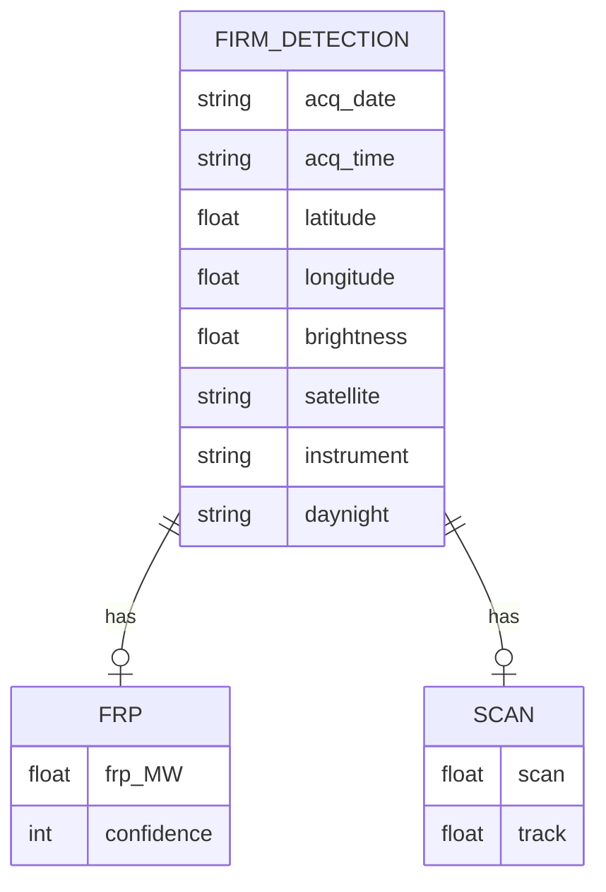
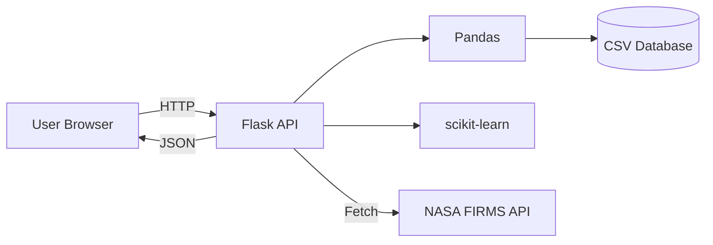
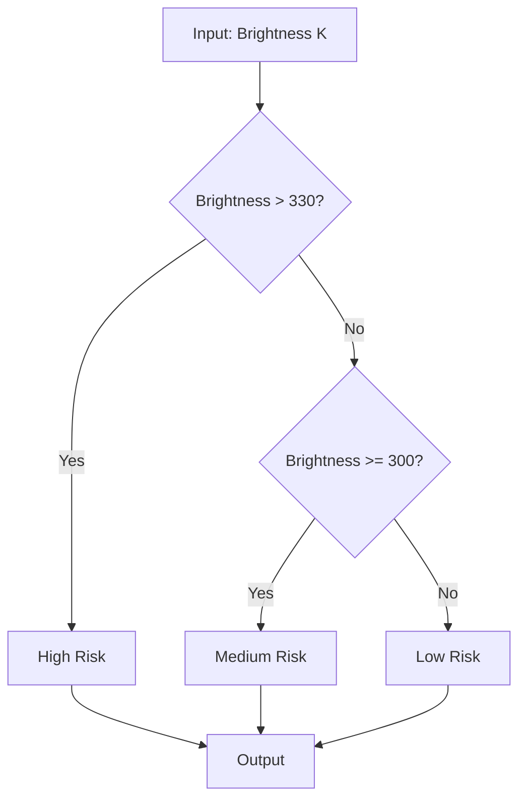
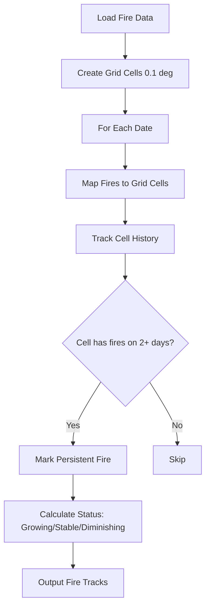
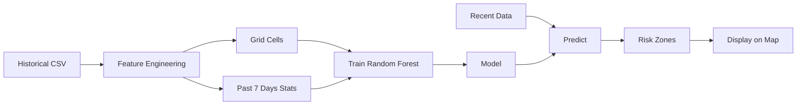
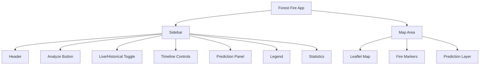
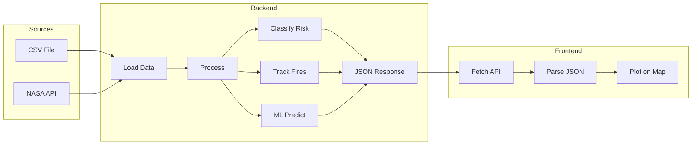

# Report Diagrams - Mermaid Code

Copy these into draw.io, Mermaid Live Editor (mermaid.live), or use in Markdown.

---

## Graph 3: MODIS Satellite Diagram



---

## Graph 7: Data Schema (ER Diagram)



---

## Graph 2: System Architecture



---

## Graph 13: Risk Classification Flowchart



---

## Graph 14: Fire Tracking Flowchart



---

## Graph 16: ML Pipeline



---

## Graph 18: API Endpoints

```mermaid
flowchart TD
    Client[Client]
    Analyze[/analyze]
    Live[/analyze/live]
    Track[/predict/tracking]
    Spread[/predict/spread]
    Forecast[/predict/future-forecast]
    Health[/health]
    Report[/api/report-stats]

    Client --> Analyze
    Client --> Live
    Client --> Track
    Client --> Spread
    Client --> Forecast
    Client --> Health
    Client --> Report

    Analyze --> CSV[(CSV)]
    Live --> NASA[NASA API]
    Track --> CSV
    Spread --> Track
    Forecast --> ML[ML Model]
```

---

## Graph 19: Component Hierarchy



---

## Graph 20: Data Flow


